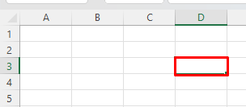
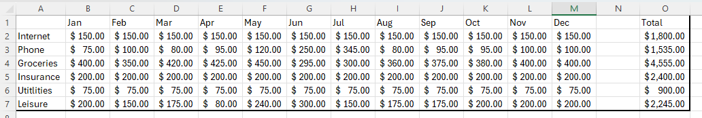
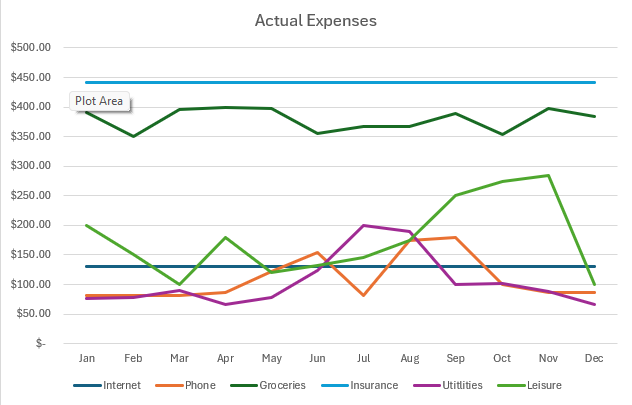
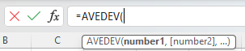

# Glossary

- Cell: A cell is the intersection of a column and a row in an Excel worksheet. It is the basic unit of a worksheet where data or formulas can be entered. TABLES are made up of cells.  
  

- Table: A table in Excel is a range of cells that are formatted as a structured grid for managing and analyzing related data. Tables offer features like sorting, filtering, and the ability to create formulas that reference the entire table.  
  

- Chart: A formula in Excel is an expression that performs calculations or manipulations on values in cells. Formulas can include mathematical operations, cell references, functions, and constants.  
  

- Function: A function in Excel is a predefined formula that performs a specific calculation. Functions take arguments, perform operations on them, and return a result. Examples include SUM, AVERAGE, IF, VLOOKUP, etc.  
  

- Format: Formatting in Excel refers to the appearance of cells, including characteristics such as font style, font size, font color, cell borders, cell shading, and number formatting.

- Data: Data in Excel refers to the information stored in cells, which can include numbers, text, dates, and more. Data can be manipulated, analyzed, and presented using various Excel features.

- Worksheet: A single tab within a workbook where data is entered and manipulated. A workbook can contain multiple worksheets, each with its own set of cells and data.

- Workbook : A workbook in Excel is a file that contains one or more worksheets. It is the primary document where data is stored and analyzed. Workbooks can contain charts, formulas, tables, and other Excel objects.  