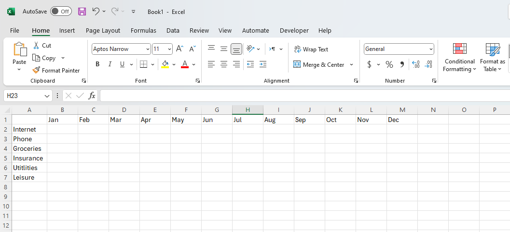
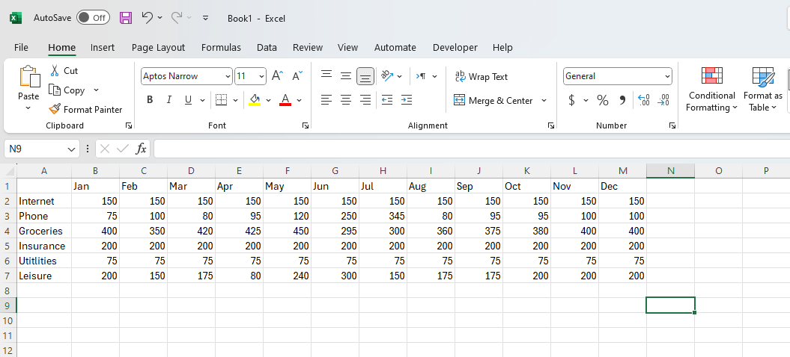
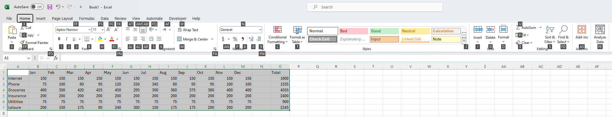
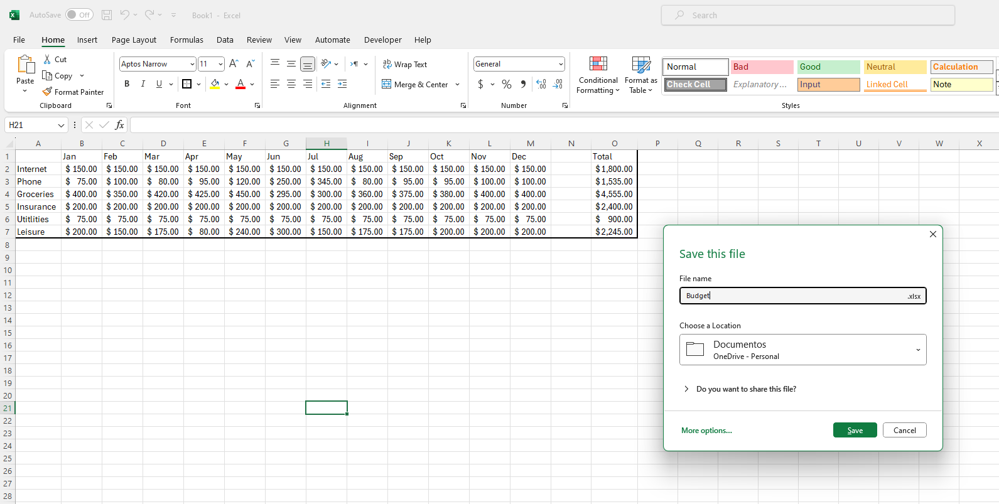

# Creating a Budget

## Overview

In this section, we will explore the very basic use of Excel: entering data in the [cells](Glossary.md), applying certain [functions](Glossary.md) on them based on their data type, such as SUM [function](Glossary.md) for numbers, creating a [table](Glossary.md) on the entries and formatting them. 

## Getting started

We will be creating a hypothetical budget to give you a general idea of how Excel can be used. 

1. Click on "Blank workbook" to create a new worksheet:
  
    * You should be on "Home" section to access "Blank workbook"
 

2. Label the [cells](Glossary.md) from [row](Glossary.md) 1 starting at [column](Glossary.md) B onward with the months of the year:
  
    * This sets up a clear timeline in this instance of creating a budget
    * [Column](Glossary.md) A is left blank for additional categories or labels as needed
    * We're labeling cells with all the months of the year; however, you can customize this based on your needs, such as only labeling through April if that suits your project.

3. Click and label [cells](Glossary.md) from [row](Glossary.md) 2 in [column](Glossary.md) A to label any expense:
  
    * We’re using [rows](Glossary.md) 2 to 7 for six expense categories, ensuring there’s a one-column gap to the right for a cleaner separation from the monthly labels in [columns](Glossary.md) B to M.
    

4. Enter your monthly expenses under the corresponding month:
  
    * For instance, if you spent $400 on groceries in January, enter '400' in the cell under 'Jan' next to 'Groceries'.

5. Click on [cell](Glossary.md) at [row](Glossary.md) 1 [column](Glossary.md) O and label it "Total":
  
    * This step is for totaling the monthly expenses. We use [cell](Glossary.md) at [row](Glossary.md) 1 [column](Glossary.md) O for the 'Total' label to maintain a clear separation from the monthly data, ensuring there's at least one blank [column](Glossary.md) as for easy distinction.

## Applying [Function](Glossary.md)

!!! note "Info"
    <i class="fas fa-exclamation-triangle"></i> [Function](Glossary.md) can only be applied to the data of the same data type. For instance, "SUM" [function](Glossary.md) in Excel can only be applied to numbers.

6. Enter "=sum(" under "Total" [cell](Glossary.md):

7. Click and drag the mouse over the numbers, then hit enter to sum how much is spent on expense(s) over time:

    * Doing this will gather all the numbers to be summed. Again, SUM [function](Glossary.md) only works with numerical values.

## Creating a [Table](Glossary.md)
8. Click and drag the mouse over the table and press ALT + H:

9. Press B:

10. Press T:

## [Formatting](Glossary.md) the data

We will [format](Glossary.md) the number data into currency as our example in this tutorial deals with a budget.

11. Click and drag over the number data and click the dollar icon($) under the "Number" sub  section of the "Home" tab, Between "Alignment", and "Styles":
  
    * In order to display currency as [format](Glossary.md) of the number entries, we will be formatting our entries to currency.

12. Press CTRL + S, label the "File name" "budget" and click "Save" to save:
  
    * We are naming the file "budget", but you can choose your desired name for it.

## Conclusion

In this section, we have learned how to create a budget using Excel. We have accomplished:

:white_check_mark: Entering data in the [cells](Glossary.md).

:white_check_mark: Applying the SUM [function](Glossary.md) to calculate the total expenses.

:white_check_mark: Creating a table to organize the information. 
 
 
 
 Excel is a powerful tool for managing and analyzing data, and it can be used for a wide range of tasks, from simple calculations to complex financial modeling. By mastering the basics of Excel, you can improve your productivity and efficiency in various work settings.

 On the next tutorial, we will learn how to create: 

# [_Chart(Click to proceed)_](Task2.md)