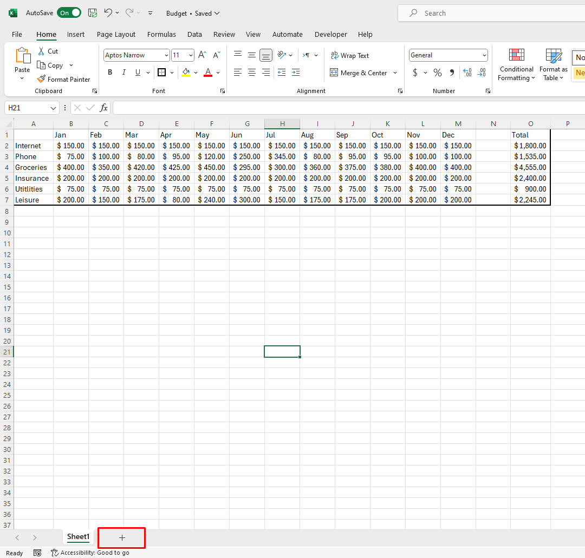

# Creating a Chart

## Overview

In this section, we will explore another basic use of Excel: Creating a Chart, and this is a follow up tutorial to the previous tutorial: [_Creating a budget_](Task1.md). Using a chart over the data provides many benefits, such as:

* Clearer understanding of trends and patterns.

* Quick and effective communication of key insights.

* Time-saving analysis and interpretation.

!!! warning "Warning"
    <i class="fas fa-exclamation-triangle"></i> Previous tutorial: [_Creating a budget_](Task1.md) must be completed before this tutorial.

Also, we will work with a separate sheet to separate data and organize the project. 

Benefits of working on separate sheets:

* Helps to keep data organized and reduces the risk of accidental overwrites

* Allows for focused analysis and cleaner presentation, as you can segregate raw data, calculations, and visualizations effectively.

## Creating a new worksheet

1. Click on the plus sign on the bottom left of the page to add a new sheet:

2. Right click on the ”Sheet1” that is on the left of the bottom bar, click “Rename” and rename it to “Expected”:

 Expected label means in the previous worksheet, we are inputting the amount you are expecting to spend on certain item(s).

3. Right click on the “Sheet2” that is on the left of the bottom bar and click “Rename” and rename it to “Actual”:
  
Actual label means in this worksheet, the actual amount that you have spent on the set item(s) from previous worksheet.

## Transferring Table

Since the separate sheets indicate that they share the same table in terms of labels, we will transfer the table from "Expected" sheet to the current worksheet:

4. From the “Expected” Sheet, click and drag over the label’s of the table made from the previous table, besides “Total” and its number. Copy and paste it to A1 on “Actual” Sheet:
   
   
You are only supposed to copy the labels, not the numbers, as we need to fill in the cells with new data.

5. Fill the Table of the “Actual” Sheet  under their respective labels:
  
This represents the actual cost of the items that you previously budgeted from.

6. Format the Data for the desired currency, as previously explained in task 1:
  
Should be the same currency as the currency previously used (link to task of currency)

## Creating a Chart
7. Click and drag the Mouse Over the Complete Table:

8. Click on the “Insert” Tab in the navigation Bar On the Top of the program:

9. Click over The picture of “Line Chart” and choose The first Option Under “2-D Line”:

10. Rename The Chart “Chart Title” to “Actual Expenses” by double clicking on the title: 

We will name it to "Actual Expenses" in the context of the current worksheet we are working on.

11. Press Ctrl + S and Save the File

## Conclusion

In this tutorial, we have accomplished:

 :white_check_mark: How to create a chart in Excel. This is a useful tool to visualize data and make it easier to understand. 
 
 :white_check_mark: We have also learned how to work with multiple sheets in Excel, which can help organize data and make it easier to manage large projects.

On the next tutorial, we will learn how to create a [_CheckList_](Task3.md) in Excel.
