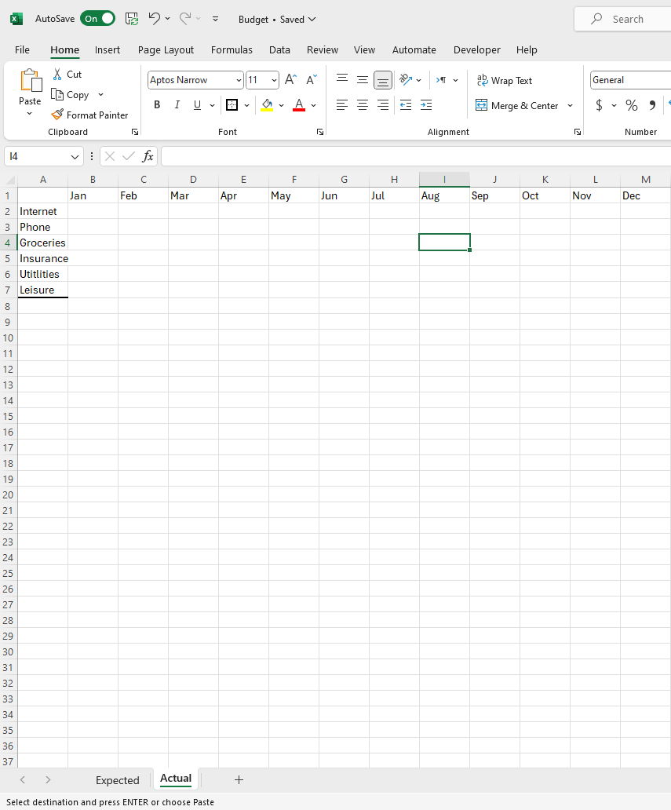
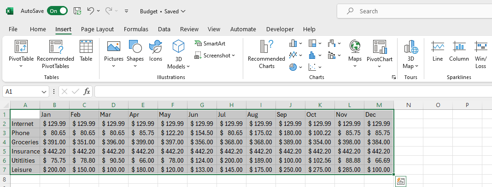

# Creating a Chart

## Overview

In this section, we will explore another basic use of Excel: Creating a [chart](Glossary.md), and this is a follow up tutorial to the previous tutorial: [Creating a budget](Task1.md). Using a [chart](Glossary.md) over the [data](Glossary.md) provides many benefits, such as:

* Clearer understanding of trends and patterns.

* Quick and effective communication of key insights.

* Time-saving analysis and interpretation.

!!! warning "Warning"
    <i class="fas fa-exclamation-triangle"></i> Previous tutorial: [Creating a budget](Task1.md) must be completed before this tutorial.

Also, we will work with a separate [worksheet](Glossary.md) to separate data and organize the project. 

Benefits of working on separate [worksheets](Glossary.md):

* Helps to keep [data](Glossary.md) organized and reduces the risk of accidental overwrites

* Allows for focused analysis and cleaner presentation, as you can segregate raw [data](Glossary.md), calculations, and visualizations effectively.

* Allows comparisons between the data of the different sheets that may have same labels.
## Creating a new [worksheet](Glossary.md)

We will continue from where we left off from previous task, [Creating a budget](Task1.md). We will have meaningful comparisons between the previous [worksheet](Glossary.md) and the new [worksheet](Glossary.md)(to be current). 

1. Click on the plus sign on the bottom left of the page to add a new sheet:

2. Right click on the ”Sheet1” that is on the left of the bottom bar, click “Rename” and rename it to “Expected”:

    * "Expected" label means in this context that from what we have created in the previous sheet from [Creating a budget](Task1.md) the numbers in it are the amounts that we anticipate spending on the expenses.

3. Right click on the “Sheet2” that is on the left of the bottom bar and click “Rename” and rename it to “Actual”:
  
    * We will label our new worksheet as "Actual". This means the actual amount that you have spent on the set expense(s) from previous [worksheet](Glossary.md). This will relate the two [worksheets](Glossary.md).

## Transferring [Table](Glossary.md)

Since the separate sheets indicate that they share the same [table](Glossary.md) in terms of labels, we will transfer the [table](Glossary.md) from "Expected" sheet to the current [worksheet](Glossary.md):

4. Click and drag over the label’s of the [table](Glossary.md) made from the previous table, besides “Total” and its number. Copy and paste it to A1 on “Actual” Sheet:
   
   
    * After copying the month labels, make sure to paste them on row 1, starting at column B. 

    * After copying the expense labels, make sure to paste them on column A, starting at row 2. 

    !!! warning "Warning"
        <i class="fas fa-exclamation-triangle"></i> 
        You are only supposed to copy the labels, not the numbers, as we need to fill in the cells with new data.
        Since we have to avoid copying the numbers, we have to go back and forth copying and pasting the labels to the "Actual" worksheet.

## Filling the [table](Glossary.md)

5. Fill the [Table](Glossary.md) of the “Actual” Sheet  under their respective labels:
  
    * This represents the actual cost of the items that you previously budgeted from.

6. [Format](Glossary.md) the [Data](Glossary.md) for the desired currency, as previously explained in [Creating a budget](Task1.md):
  

## Creating a Chart
7. Click and drag the Mouse Over the Complete [Table](Glossary.md):

8. Click on the “Insert” Tab in the navigation Bar On the Top of the program:

9. Click over The picture of “Line Chart” and choose The first Option Under “2-D Line”:

10. Rename The [Chart](Glossary.md) “Chart Title” to “Actual Expenses” by double clicking on the title: 

    * We will name it to "Actual Expenses" in the context of the current [worksheet](Glossary.md) we are working on.

11. Press Ctrl + S and Save the File
    
## Conclusion

In this tutorial, we have accomplished:

 :white_check_mark: How to create a [chart](Glossary.md) in Excel. This is a useful tool to visualize [data](Glossary.md) and make it easier to understand. 
 
 :white_check_mark: We have also learned how to work with multiple [worksheets](Glossary.md) in Excel, which can help organize data and make it easier to manage large projects.

On the next tutorial, we will learn how to create: 
## [_Check List(Click to proceed)_](Task3.md)
