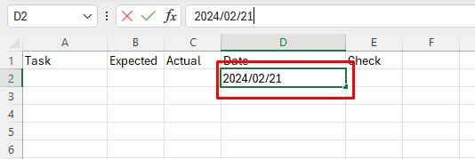
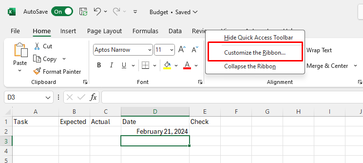

# Making A CheckList

## Overview

In this section, we will explore another basic use of Excel: Creating a Checklist. A checklist is a list of items that need to be completed or checked off. It is a useful tool for:

* Tracking the completion of various tasks or items.
* Organizing and prioritizing tasks efficiently.
* Visual cue for what's been accomplished and what's pending.
* Monitoring progress toward goals or deadlines

In this tutorial, we will be creating a check box in the context of budgeting as we did in previous tutorials. We will work on a new sheet, and keep track of how much was "actually" spent on certain expenses compared to "expected" expense per given date.

We will also expand on different use of formatting and a new use to it.

!!! warning "Warning"
    <i class="fas fa-exclamation-triangle"></i> In order to do this tutorial, you should have successfully completed the previous tutorials: [_Creating a budget_](Task1.md) and [_Creating a chart_](Task2.md)

## Setting up 
We will first create a new worksheet and add new labels.

1. Click on the Plus sign to create a new Sheet, and rename the sheet to “CheckList”.  
  

2. Hover Over the border between ROW A and ROW B, until you see the cursor become a separator.  
 

3.  Click and drag on Column A to enlarge the size of the column.  
    
Enlarging the size of the cells are beneficial as if they are not big enough, data in the cells might not be fully visible. We are enlarging Column A as it will have descriptions/title for checklist

4.  Click on cell A1  to E1 and Label them in sequence, “Task,” “Expected,” “Actual,” “Date,” "Check”.  
  
Since we are using budgeting as an example for this tutorial, we will use labels, "Expected" and "Actual" from previous tutorials to keep track of the "actual" data compared to "Expected" data. 

## [Formatting](Glossary.md) cells under labels

!!! note "Info"
    <i class="fas fa-info-circle"></i> Cells can be [Formatted](Glossary.md) even if they are empty. Their input will automatically get converted to their given [Format](Glossary.md).

5. Click and drag the cells under "Expected" and "Actual to needed amount.

In our example, we are highlighting the cells under those labels down to 11.

5.  Format Cells Under Labels “Expected” and “Actual” to currency (As previously explained in [_Creating a budget_](Task1.md))  
 
Note that although the cells under those labels are empty, they are highlighted from the previous step, so their inputs will automatically be formatted to currency.

6.  [Format](Glossary.md) the cells under label “date” by going to the drop down menu on the “Number” sub section and set it to “Long Date” 
  
 Again, data format can be done before inputting data. This will make the input data into date format. The Date input must have three sections divided by slash or dash in order to work, but date usually follows the date format(YYYYMMDD).  

## Creating a checklist
!!! note "Info"
    <i class="fas fa-info-circle"></i> Check box is under the "Developer" Tab, but we need to manually add it, as it is not provided in Excel by default.

7.  Right Click Under The “Review” Tab on the top of the Navigation Bar and hit the “customize Ribbon Option”, and check mark the “Developer” Option, press OK.    
  
  
  
   

7.  Add a checkbox by going to the Developer Tab, click on “Insert” dropdown menu, and  click on “CheckBox” icon under “Form Controls”,then Click on the cell under the label “Check” to add the checkbox.  

   
If the checkBox icon is too big to fit in a cell for Check, Resize the cell(as previously thought) to fit in the CheckBox.

8.  Hover the mouse on the bottom right side edge of the cell with Check cell until you see a black cross.   
   
  

9.   Click and drag down the mouse to row 10 in order to duplicate the check boxes 
  
   
In this example, we extended the cells under Check to row 10 to duplicate the Check Box icons  

10. Fill Up The labels Under “Task”, “Expected”,”Actual”, “Date”, as necessary.  
  
This will be a constant update as new task arrive and new data in inputted.  

11. Press Ctrl + S and Save the File.

## Conclusion

Congratulations! You have successfully finished the Excel tutorial Basics. You have learned how to create:

 :white_check_mark: Budget

 :white_check_mark: Chart

 :white_check_mark: Checklist

These are useful tools that can help you organize and manage your projects more effectively. You are now ready to start using Excel for your own projects and tasks. There is still much more to learn about Excel, so keep practicing and exploring the different features and functions of the program. Good luck!.  

!!! success "Success"
    You have successfully completed all the tutorials!
    