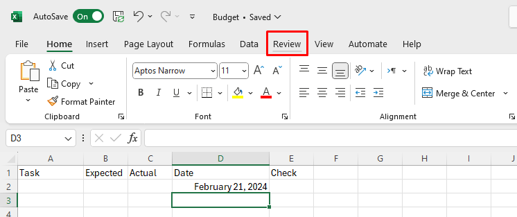
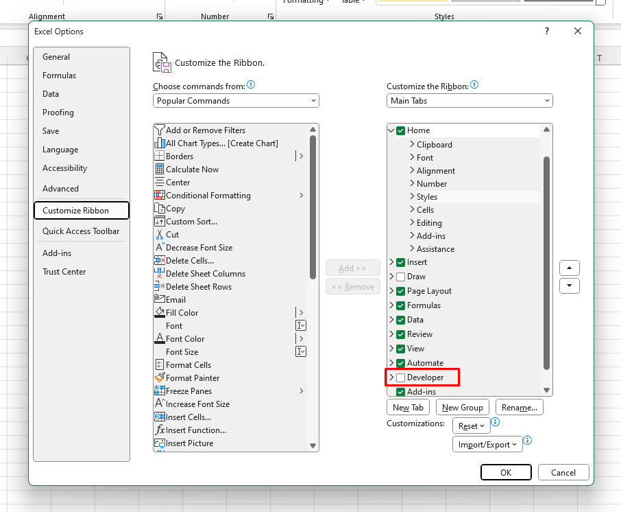
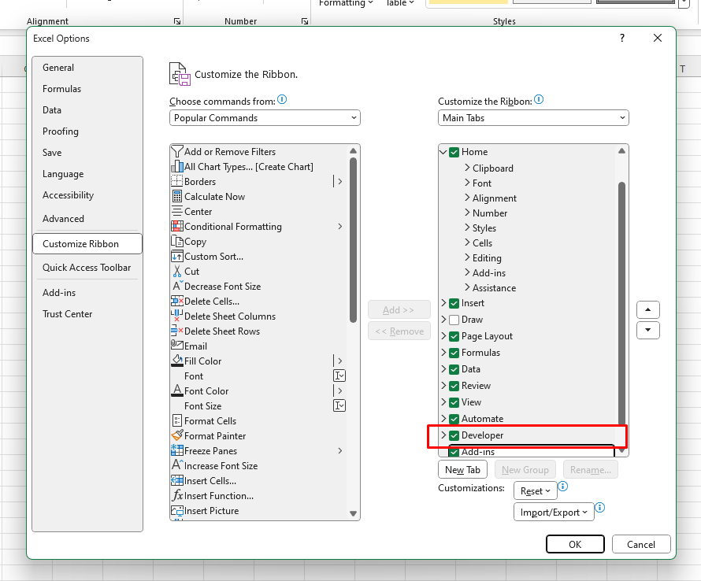
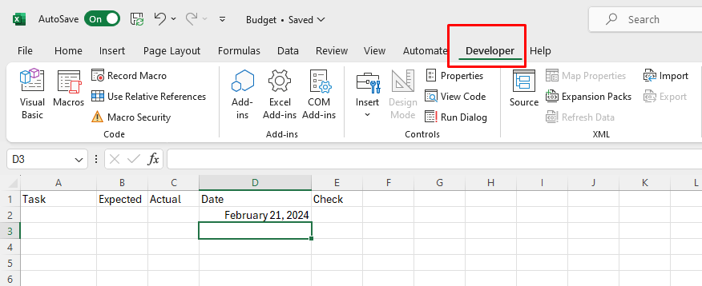

# Making A CheckList

## Overview

In this section, we will explore another basic use of Excel: Creating a Checklist. A checklist is a list of items that need to be completed or checked off. It is a useful tool for:

* Tracking the completion of various tasks or items.
* Organizing and prioritizing tasks efficiently.
* Visual cue for what's been accomplished and what's pending.
* Monitoring progress toward goals or deadlines

In this tutorial, we will be creating a CheckList in the context of budgeting as we did in previous tutorials. We will work on a new [worksheet](Glossary.md), and keep track of how much was "actually" spent on certain expenses compared to "expected" expense per given date.

We will also expand on different use of [formatting](Glossary.md) and a new use to it.

!!! warning "Warning"
    <i class="fas fa-exclamation-triangle"></i> In order to do this tutorial, you should have successfully completed the previous tutorials: [_Creating a budget_](Task1.md) and [_Creating a chart_](Task2.md)

## Setting up 
We will first create a new [worksheet](Glossary.md) and add new labels.

1. Click on the Plus sign to create a new Sheet, and rename the sheet to “CheckList”.  
  

2. Hover Over the border between [cell](Glossary.md) A and [cell](Glossary.md) B, until you see the cursor become a separator.  
 
    * This image displays different [cells](Glossary.md), but the logic applies.

3.  Click and drag to the right to enlarge the size of column A.  
    
    * Enlarging the size of the [cells](Glossary.md) are beneficial as if they are not big enough, data in the cells might not be fully visible. We are enlarging [cell](Glossary.md) A as it may contain lengthy text type labels.

4.  Label [cells](Glossary.md) A1  to E1 in sequence: “Task,” “Expected,” “Actual,” “Date,” "Check”:
  
    * Since we are using budgeting as an example for the entirety of the tutorials, we will use labels, "Expected" and "Actual" from previous tutorials to keep track of the "actual" [data](Glossary.md) compared to "Expected" data. 

## [Formatting](Glossary.md) cells under labels

!!! note "Info"
    <i class="fas fa-info-circle"></i> [Cells](Glossary.md) can be [Formatted](Glossary.md) even if they are empty. Their input will automatically get converted to their given [Format](Glossary.md).
!!! warning "Warning"
    <i class="fas fa-exclamation-triangle"></i> [Format](Glossary.md) can only be applied to certain [data](Glossary.md) type of the [cell](Glossary.md) input, so in the case of [formatting](Glossary.md) multiple [cells](Glossary.md), it is essential that [data](Glossary.md) type of the [cells](Glossary.md) are consistent. 
    For instance, we cannot [format](Glossary.md) a text into currency.

5. Click and drag the [cells](Glossary.md) under "Expected" and "Actual to needed amount.

    * In our example, we are highlighting the cells under those labels down to row 11.

5.  [Format](Glossary.md) [cells](Glossary.md) Under Labels “Expected” and “Actual” to currency (As previously explained in [_Creating a budget_](Task1.md))  
 

6.  [Format](Glossary.md) the [cells](Glossary.md) under label “date” by going to the drop down menu on the “Number” sub section and set it to “Long Date” 
  
    * Again, [data](Glossary.md) format can be done before inputting [data](Glossary.md). This will make the input [data](Glossary.md) into date [format](Glossary.md).
    !!! note "Info"
        <i class="fas fa-info-circle"></i>      The Date input must have three sections divided by slash or dash in order to work, but date usually follows the date format(YYYYMMDD). 

        
        

## Creating a checklist
!!! note "Info"
    <i class="fas fa-info-circle"></i> To create a checklist, we need to access the "Developer" Tab, but we need to manually add it, as it may not be provided in Excel by default.

7.  Right Click The “Review” Tab on the top of the Navigation Bar and hit the “customize Ribbon Option”, and check mark the “Developer” Option, press OK.    
  
  
  
   

7.  Add a checkbox by going to the Developer Tab, click on “Insert” dropdown menu, and  click on “CheckBox” icon under “Form Controls”,then Click on the cell under the label “Check” to add the checkbox.  

7. Resize the checkBox to fit in the [cell](Glossary.md) under "Check" [cell](Glossary.md) by clicking and dragging one of the circles at one of the edges on the Check Box icon:
     
      

8.  Hover the mouse on the bottom right side edge of the Check Box [cell](Glossary.md) until you see a black cross.   
   
    * The image displays "2" but you can imagine it being Check Box instead.

9.   Click and drag down the mouse to row 10 in order to duplicate the check boxes 
  
   
    * In this example, we extended the [cells](Glossary.md) under Check to row 10 to duplicate the Check Box icons  

10. Fill Up The labels Under “Task”, “Expected”,”Actual”, “Date”, as necessary.  
  
    * This will be a constant update as new task arrive and new [data](Glossary.md) in inputted.  

11. Press Ctrl + S and Save the File.

## Conclusion

Congratulations! You have successfully finished the Excel tutorial Basics. You have learned how to create:

 :white_check_mark: Budget

 :white_check_mark: Chart

 :white_check_mark: Checklist

These are useful tools that can help you organize and manage your projects more effectively. You are now ready to start using Excel for your own projects and tasks. There is still much more to learn about Excel, so keep practicing and exploring the different features and functions of the program. Good luck!.  

!!! success "Success"
    You have successfully completed all the tutorials!
    