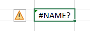

# Troubleshooting

## "####" Error

If you see an error like this:  

It means that the cell is not wide enough to display the content. To fix this, you can either increase the column width or wrap the text within the cell. Here's how you can do it:

1. **Increase Column Width:**  
    - Hover over the right edge of the column header until you see a double-headed arrow.
    - Double-click to automatically adjust the column width to fit the content.

2. **Wrap Text:**
    - Select the cell or range of cells you want to wrap.
    - Go to the "Home" tab on the Excel ribbon.
    - Click on the "Wrap Text" button in the "Alignment" group.

## "VALUE!" Error

If you see a `#VALUE!` error in a cell, it means that there is a problem with the formula or function used in that cell. This error occurs when Excel cannot interpret the formula or function correctly. Here are some common reasons for the `#VALUE!` error and how to fix them:

1. **Incorrect Data Type:**  
    - Check if the data types in the formula are compatible. For example, if you are trying to perform a mathematical operation on text values, Excel will return a `#VALUE!` error.
    - Make sure that the data ranges or cell references in the formula are correct and do not contain any errors.

2. **Missing Arguments:**
    - If a function or formula requires certain arguments, make sure that all the required arguments are provided. Missing arguments can cause the `#VALUE!` error.

## "NAME?" Error

If you see a `#NAME?` error in a cell, it means that Excel does not recognize the function or formula used in that cell. This error occurs when Excel cannot find the function or formula name. Here's how you can fix the `#NAME?` error:

1. **Check Spelling:**  
    - Make sure that the function or formula name is spelled correctly. Excel is case-insensitive, so the case of the function name does not matter.

2. **Function Not Available:**  
    - Some functions may not be available in your version of Excel. Check if the function you are using is supported in your version of Excel.