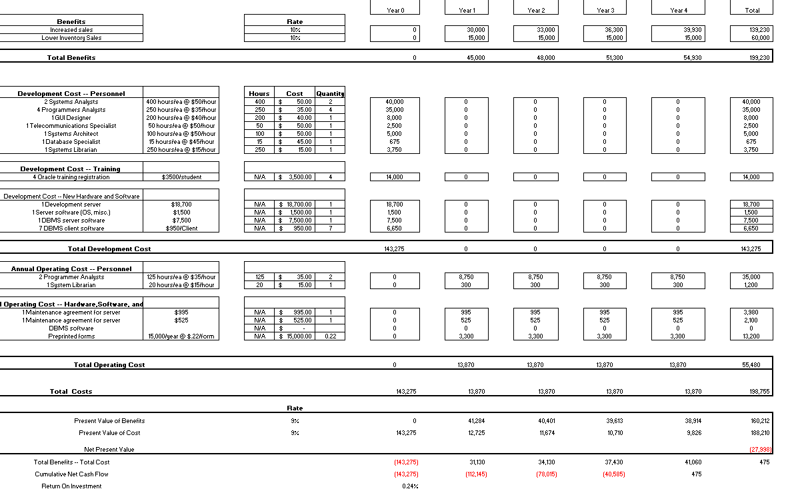
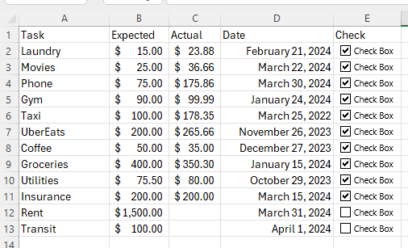

# Introduction

Welcome to a beginners guide to Excel. Microsoft's Excel is a powerful tool that can be used for a variety of tasks. This documentation will guide you through a collection of 3 task that are part of an Excel beginners project. This tutorial’s main purpose is to teach the main basic foundation steps on how to use Microsoft’s Excel, including teaching new users to use the formula tools, create graphs, and extract information from data. It aims to guide you through Microsoft’s Excel UI and get you acquainted with the capabilities of the program, providing you with the knowledge to start using Excel for your own projects.

## Intended Users

This documentation is targeted towards the following Users:

* Beginner level users of Microsoft's 365 Excel
* Small business owners that would like to automatize and keep track of their business
* Beginner Developers that would like to learn how to use Excel for their projects
* Anyone who would like to learn how to use Excel

## Prerequisites Knowledge

Before you start this tutorial, you should have a basic understanding of the following:

* A basic understanding of how to navigate through a computer
* Basic Math skills
* Basic knowledge of Excel layout
* Basic knowledge of Microsoft's office layout

## Software Requirements

Before you start this tutorial, you should have the following software installed:

* Windows Operating System
* Own a copy of Microsoft's 365
* Installed Microsoft Excel

## Procedures Overview

The main sections of the documentation are:

* Milestone 1: Creating a small budget table in Excel 
* Milestone 2: Creating a chart in Excel 
* Milestone 3: Creating a CheckList in Excel 

## Conventions

Maybe there are some, maybe not. I don't know yet.